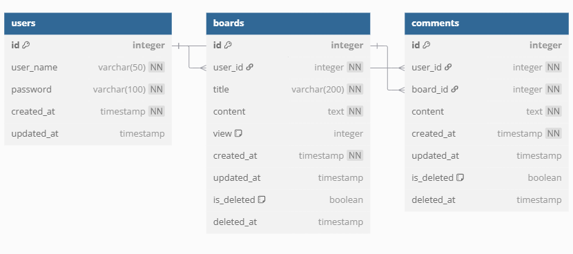

# MST365

- LLM과 MCP(Model Context Protocol)을 활용한 자연어 기반 E2E 자동화 테스트 프로그램
- 기간: 2025.04.18 ~ 2025.05.23

---

## 팀원 소개

| **김정우**                               | **백승훈**                | **전희성**                     | **장은정**                       | **이은선**                       | **김우영**                     |
| ---------------------------------------- | ------------------------- | ------------------------------ | -------------------------------- | -------------------------------- | ------------------------------ |
| - 팀장 - 백엔드 개발 - host 개발 | - 젠킨스 플러그인 개발| - host 개발  - 플러그인 개발 | - 프론트 개발 - 백엔드 개발 | - 인프라 - host 개발 | - 프론트 개발 - 백엔드 개발 |

---

## 기술 스택

---

### Frontend

### Backend

### DB

### Infra & DevOps

### Collaboration Tools
  
---

## 주요 기능
1. **데모 웹사이트**
    - 플러그인 테스트를 위한 데모 웹사이트 제공
    - 다양한 라이브러리, 프레임워크로 제작되어 있음.
    - 기본적인 CRUD 기능과 무한 스크롤 등 다양한 기능을 제공함으로 우리 플러그인을 통해 직접 테스트 해볼 수 있음
2. **Jenkins Plugin**
    - 공개 되어 있는 소스 코드를 통해 Jenkins에 마운트 가능한 hpi 형태의 플러그인 제공
3. **스크립트 작성 기능**
    - Jenkins plugin 설치 시, Jenkins UI를 통해 플러그인에 필요한 자연어 스크립트를 작성하는 기능을 제공함.
4. **자연어 기반 자동화 E2E 테스트 기능**
    - 자연어 스크립트를 기반으로 LLM (chat gpt, claude 등)과 MCP를 사용하여 E2E 테스트가 필요한 웹 사이트에 대하여 자동화 E2E 테스트를 제공하는 기능을 함.
5. **테스트 결과 리포트 열람 기능**
    - Jenkins 내부 UI를 통해 HTML 형태로  리포트를 생성하여 E2E 테스트에 대한 상세 리포트를 제공함.

---

## 파일 구조 및 CI/CD 파이프라인 설명
- demo 폴더 내부 각 프레임워크, 라이브러리에 따라 구분된 폴더 별로 dockerfile, jenkinsfile 위치
- 따라서, 각 프론트엔드 프레임워크 별로 pipeline이 존재하고 필요할 경우 각 파이프라인 빌드를 통해 배포된 웹사이트의 프레임워크를 바꿔서 사용하는 형태
- gitlab push 이벤트 발생 시 hook

1. **demo**
- demo-back
    - Spring boot 데모 웹사이트를 위한 Spring boot 프로젝트 폴더
- demo-front
    - demo-react, demo-next 등 프레임워크 별 프로젝트 폴더

2. **mcp host**
- host 개발을 맡은 담당자들의 host 프로젝트 폴더
3. **plugin**
- Jenkins plugin 개발 용 폴더

## ERD
---

---
## 데모 웹사이트 시스템 구조도
---

---
## 화면 예시
---
### Jenkins UI

### 데모 웹사이트

---
## 링크
---
- **노션**:
- **데모 웹사이트**:
---
