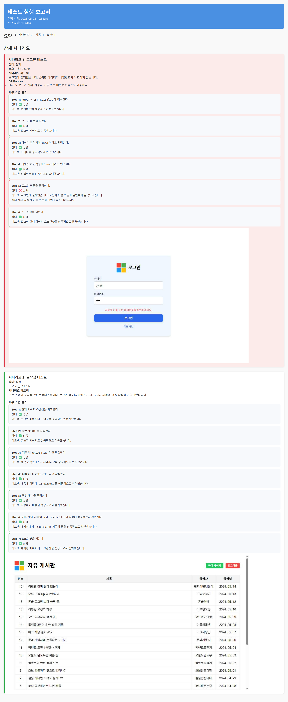

# MST365

LLM과 Playwright MCP를 활용한 자연어 기반 E2E 자동화 테스트 프로그램

## 📅 프로젝트 기간

2025.04.18 ~ 2025.05.22

## 🚀 주요 기능

### 1. Jenkins Plugin

- Jenkins에 마운트 가능한 hpi 형태의 플러그인 개발
- Jenkins UI를 통한 자연어 테스트 시나리오 작성 및 관리
- 테스트 결과 리포트 생성 및 관리

### 2. 자연어 기반 E2E 테스트

- Playwright MCP로 브라우저 제어를 통한 E2E 테스트 구현
- LLM(ChatGPT, Claude 등)과 Playwright MCP를 활용해서 LLM이 테스트를 진행
- 사용자의 자연어 시나리오를 기반으로 LLM이 판단
- 세부 스텝별 결과 및 피드백 산출

### 3. 데모 웹사이트

- 다양한 프레임워크(React, Next.js, Vue.js)로 구현된 테스트용 웹사이트
- 기본적인 CRUD 기능과 무한 스크롤 등 기능 제공
- LLM 토큰 비교를 위한 CSS 분리구조와 인라인구조 구분 테스트

## 📁 프로젝트 구조

```
MST365/
├── plugin/           # Jenkins 플러그인 소스 코드
├── host/            # MCP 호스트 구현
│   ├── python/      # Python 버전 호스트
│   └── typescript/  # TypeScript 버전 호스트
├── demo/            # 데모 웹사이트
│   ├── demo-front/  # 프론트엔드 데모 (React, Next.js, Vue.js)
│   └── demo-back/   # 백엔드 데모 (Spring Boot)
├── exec/            # 실행 관련 파일
└── assets/          # 이미지 및 기타 리소스
```

## 🖥 화면 예시

### Jenkins UI

- 플러그인 설치 후 생성되는 탭
  
- 자연어 테스트케이스 목록
  
- 테스트케이스 시나리오 생성,작성 및 수정
  
- 결과 리포트 목록
  
- 리포트 (python)
  
- 리포트 (typescript)
  

### 데모 웹사이트

- 데모 메인 화면
  
- 데모 로그인 화면
  
- 데모 회원가입 화면
  
- 데모 게시판 화면
  
- 데모 게시글 화면
  
- 데모 마이페이지 화면
  

## 👥 팀원 소개

| **김정우**                              | **백승훈**      | **전희성**      | **장은정**         | **이은선**                       | **김우영**         |
| --------------------------------------- | --------------- | --------------- | ------------------ | -------------------------------- | ------------------ |
| - 팀장 <br>- MCP Host 개발 <br>- 인프라 | - 플러그인 개발 | - 플러그인 개발 | - Demo 페이지 개발 | <br>- MCP Host 개발 <br>- 인프라 | - Demo 페이지 개발 |

## 🛠 기술 스택

### Frontend


### Backend


### DB


### Infra & DevOps


### Collaboration Tools

  
