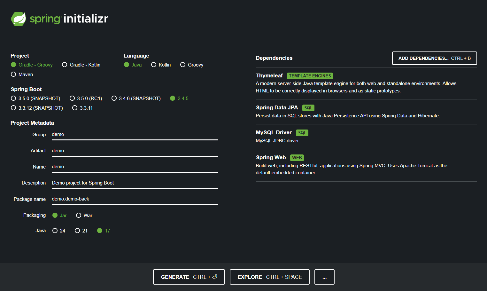
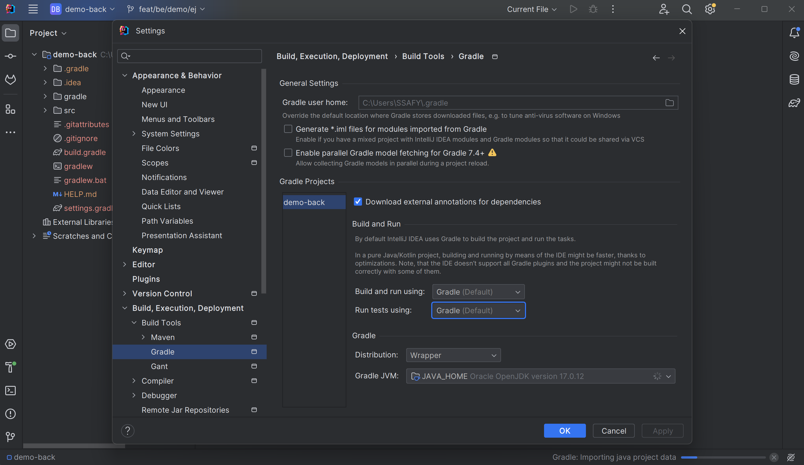
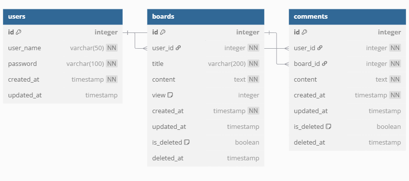

# demo 프로젝트 세팅 정리

### 파일 구조

```plaintext
demo/
├─ demo-front/   (Next.js 프론트엔드)
└─ demo-back/    (Spring Boot 백엔드)
```

---

### Spring Boot 설정 기록

#### 1. [start.spring.io] 사이트에서 프로젝트 생성

https://start.spring.io/


→ 생성 후 다운로드한 zip 파일을 demo-back/ 폴더에 압축 해제.

---

#### 2. IntelliJ에서 프로젝트 설정

- File > Settings
- Build, Execution, Deployment > Build Tools > Gradle
  

---

#### 3. 서버 설정(DB 없이 - 테스트용)

```properties
# src/main/resources/application.properties
spring.autoconfigure.exclude=org.springframework.boot.autoconfigure.jdbc.DataSourceAutoConfiguration
```

---

#### 4. 테스트 API 작성

```java
// demo/demo-back/src/main/java/demo/demo_back/HelloController.java
@RestController
public class HelloController {

    @GetMapping("/hello")
    public String hello() {
        return "Hello, Spring Boot!";
    }
}
```

---

#### 5. 서버 실행 & 확인

1. 서버 실행
   - DemoBackApplication 실행
2. 브라우저 접속
   ```
   http://localhost:8080/hello
   ```
3. 메시지 확인
   ```html
   Hello, Spring Boot!
   ```

---

### 6. ERD



---

### 7. API 명세


---

### 프로젝트 구조 및 설명

이 문서는 프로젝트의 서비스 계층(`service/`) 구조와 그 목적, 그리고 인터페이스-구현체 패턴, DTO의 의미 등 자주 질문된 내용을 정리한 문서입니다.

---

## 📁 service/ vs service/impl/ 폴더 구조

### `service/`란?
- **기능의 "무엇을 할지" (What)** 를 선언하는 계층
- 보통 **인터페이스**만 존재
- 예: `AuthService`, `UserService`, `BoardService`

### `service/impl/`란?
- **기능의 "어떻게 할지" (How)** 를 정의하는 계층
- 실제 인터페이스를 구현한 클래스가 들어감
- 예: `AuthServiceImpl`, `UserServiceImpl`, `BoardServiceImpl`

### 왜 이렇게 나눔?
| 이유 | 효과 |
|------|------|
| 역할 분리 | 구조가 깔끔하고 가독성 향상 |
| 테스트 용이 | 인터페이스만 mocking 가능 |
| 유지보수 | 구현체만 교체해도 인터페이스 기반 코드는 변경 없음 |

---

## DTO(Data Transfer Object)란?

### 정의
> 클라이언트 ↔ 서버 간 **요청/응답** 데이터를 전달하기 위해 사용하는 객체

### 쓰는 이유
| 목적 | 설명 |
|------|------|
| 보안 | Entity 그대로 노출 시 민감 정보 유출 위험 |
| 유연성 | 응답 포맷을 클라이언트에 맞춰 가공 가능 |
| 유효성 검증 | `@Valid` 등으로 Request DTO 유효성 체크 가능 |

---

## 예외 처리 전략 요약

### Soft Delete
- `Board`와 `Comment`는 삭제 시 `isDeleted = true` + `deletedAt` 설정
- DB에는 남아있지만 조회 시 제외

### 커스텀 예외
- `BoardNotFoundException`, `UnauthorizedAccessException`, `InvalidRequestException` 등
- 의미 있는 예외 처리를 위해 사용

---

## 구성 정리 (요약)

| 폴더 | 역할 |
|--------|------|
| `controller/` | API 진입점, 요청 처리, DTO ↔ 서비스 연결 |
| `service/` | 기능 선언 (인터페이스) |
| `service/impl/` | 기능 구현 (비즈니스 로직) |
| `repository/` | DB 접근 계층 (JPA) |
| `dto/` | 요청/응답 전용 데이터 객체 |
| `exception/` | 사용자 정의 예외 정의 |
| `domain/` | JPA Entity 정의 |
