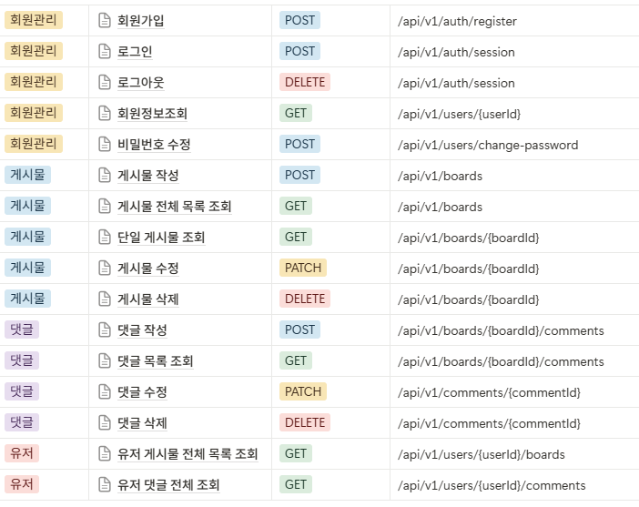

# demo 프로젝트 세팅 정리

### 파일 구조

```vbnet
demo/
├─ demo-front/   (Next.js 프론트엔드)
└─ demo-back/    (Spring Boot 백엔드)

```

---

### Spring Boot 설정 기록

#### 1. [start.spring.io] 사이트에서 프로젝트 생성

```
https://start.spring.io/
```


→ 생성 후 다운로드한 zip 파일을 demo-back/ 폴더에 압축 해제.

---

#### 2. IntelliJ에서 프로젝트 설정

- File > Settings
- Build, Execution, Deployment > Build Tools > Gradle
  

---

#### 3. 서버 설정(DB 없이 - 테스트용)

```properties
// src/main/resources/application.properties
spring.autoconfigure.exclude=org.springframework.boot.autoconfigure.jdbc.DataSourceAutoConfiguration
```

---

#### 4. 테스트 API 작성

```java
//demo/demo-back/src/main/java/demo/demo_back/HelloController.java
@RestController
public class HelloController {

    @GetMapping("/hello")
    public String hello() {
        return "Hello, Spring Boot!";
    }
}
```

---

#### 5. 서버 실행 & 확인

1. 서버 실행
   - DemoBackApplication
2. 브라우저 접속
   ```
   http://localhost:8080/hello
   ```
3. 메시지 확인
   ```html
   Hello, Spring Boot!
   ```

---

### 6. ERD

## 
---

### 7. API 명세


